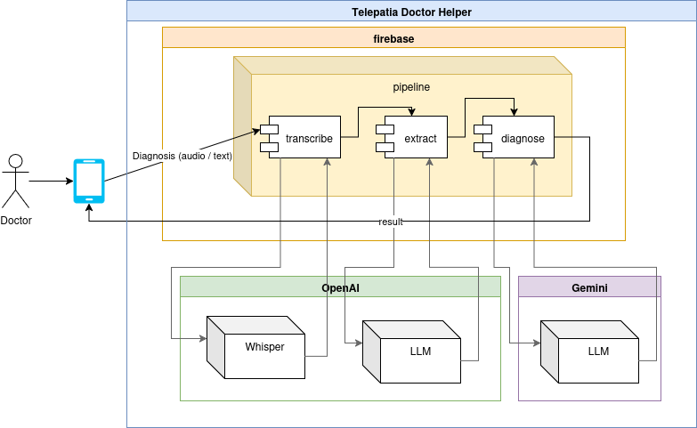

# Telepatia AI Techtest Backend

Telepatia technical test backend based on Firebase Functions. The functions use OpenAI and Gemini models to transcribe audio, extract information, and suggest preliminary diagnoses.

## Components Diagram



## Requirements
- Node.js 22
- [Firebase CLI](https://firebase.google.com/docs/cli) installed globally
- API keys for OpenAI and Gemini

## Environment variables
In the `functions` directory, rename the `.env.example` file to `.env` and fill in the empty values:

```
cd functions
mv .env.example .env
```

```
OPENAI_API_KEY=<your_openai_api_key>
OPENAI_MODEL=gpt-4o-mini        # optional
GEMINI_API_KEY=<your_gemini_api_key>
GEMINI_MODEL=gemini-1.5-flash   # optional
PROVIDER=gemini                 # or openai
```

To run this project you need a Firebase project:

1. Create a project in the [Firebase console](https://console.firebase.google.com) by clicking **Add project** and following the steps, or run `firebase projects:create <your-project-id>` with the Firebase CLI.
2. The **Project ID** is the unique identifier shown when the project is created and is available later under **Project settings > General**. Use this ID with the CLI (for example `firebase use <your-project-id>` or `firebase emulators:start --project <your-project-id>`).

Get an OpenAI API key from <https://platform.openai.com/api-keys> by creating a new secret key in your account dashboard.

Get a Gemini API key from <https://ai.google.dev/gemini-api/docs/api-key> by signing in with your Google account, creating an API key for your Google Cloud project, and copying the generated key.

## Installation
Install the dependencies inside `functions`:

```
cd functions
npm install
```

## Local execution
From the root of the repository run:

```
./run-local.sh
```

The script clears previous builds, loads the environment variables, compiles TypeScript, and starts the Firebase emulators for functions only.

## Tests
To run the test suite:

```
cd functions
npm test
```
